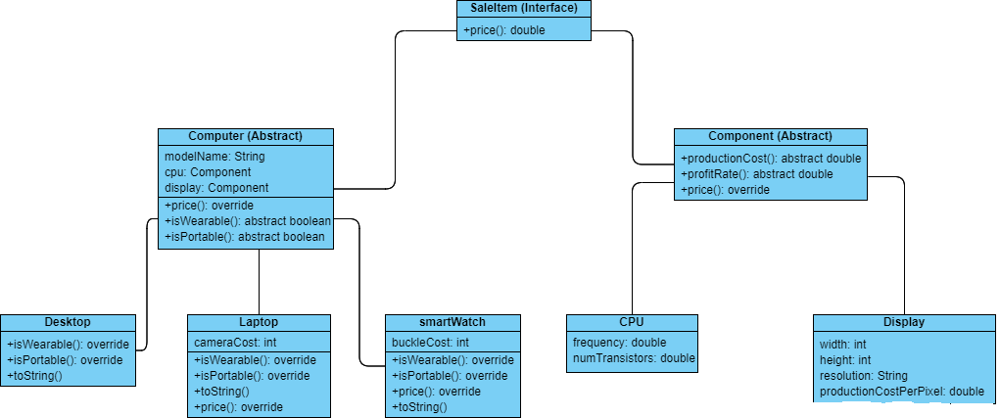

### Collaboration Rules
This lab  is an individual work. Everyone should submit their own work. You can use any material from the course, or any other resource on Java programming language. You can discuss lecture related topics, the problem at the concept level with other students, but not the solution. You can reuse (copy-paste) code from the lecture notes, textbook, or code given in the lab, but not from others (internet sources, other students etc.)

### Honor Code - by submitting lab work I accept:
- This code is my own work. 
- I did not consult to any program written other students. 
- I did not search for the solution of the problem in the internet.
- I did not copy-paste code written by others.
- This code is my own work.

### IMPORTANT

* DON'T COPY PASTE code from anybody or any other resource. The code should be written by you. The code similarity tools will find such codes and disciplinary action will be taken.
* You should solve the problem the way we described. By not following instructions, you may lose points.
* Check Blackboard LAB6 for possible corrections.
* Print out in the same format, points will be taken off, if you don't print in the same format.
* It is normal for you get "cannot be resolved" type of errors when you first import your project from Github because all classes are not implemented yet. You will resolve these errors as you create and implement the necessary classes.
* Don't forget to implement setters and getters of the private variables.
* Pay attention to use the appropriate access modifier for instance variables and methods.

### LATE SUBMISSION 

Each Lab has its late submission rule. Lab6 late submission is :
* Regular Submission: Noon 12pm April 2, at the end of the lab
* Late Submission: April 2
   * 12:05: -2 points
   * 12:10: -5 points
   * 23:59: -45 points

# Lab 6: Computer Store
In this lab, you are asked to implement an application that emulates a computer store that sells computers. A device is classified as a computer if it has a CPU and a display (normally there are many other components but we chose CPU and display for simplicity). Class diagram of the application is below:



\+method() means a public method.

There are three packages: main, computer and component.

Computer and its subclasses are in the computer package.
Component and its subclasses are in the component package.
ComputerStore, SaleItem and Lab6Main are in the main package.

# Given Classes
## Lab6Main Class
This class contains the main method of the program. It also contain prelab and inlab methods. You can uncomment the part that you want to test as previous labs. 

## ComputerStore Class
This class contains a list of computers. It has method (addComputer) to add a new computer to the list. It also has a method (listComputers) to list all computers. This class is provided to you in the template. **You should not change anything in this class for the prelab part**.  

# Classes to be implemented
The followings are the classes that you need to implement

## SaleItem Class
This is an **interface** and it has only one method "price" which returns a double.
```java
double price();
```

## Computer Class
This is an **abstract** class.
It implements **SaleItem**.
It has three **instance variables**:

```java
modelName: String
cpu: Component
display: Component
```

These instance variables are **protected**.

It has three **methods**: 

```java
double price() { return cpu.price() + display.price(); } 
abstract boolean isWearable()
abstract boolean isPortable()
```

## Desktop Class
It has a constructor which takes cpu, display and modelName.

```java
public Desktop(CPU cpu, Display display, String modelName)
```

Desktop is not a wearable computer. So, you need to override isWearable to return false.\
Desktop is not a portable computer. So, you need to override isPortable to return false.

Don't forget to add toString method for printing.

```java
public String toString() {
	return "Desktop:\n- modelName=" + getModelName() + "\n- Cpu=" + getCpu() + "\n- Display="
			+ getDisplay() + "\n- price=" + String.format("%.2f", price());
}
```

## Laptop Class
It has a constructor which takes cpu, display, modelName and cameraCost.

```java
public Laptop(CPU cpu, Display display, String modelName, int cameraCost)
```

Laptop is not a wearable computer. So, you need to override isWearable to return false.\
Laptop is a portable computer. So, you need to override isPortable to return true.

Laptop adds its cameraCost to the price. So, laptop should override its super class' price method to return the **updated price (cpu + display + cameraCost)**.

```java
@Override
public double price() {
	return ..........;
}
```

Don't forget to add toString method for printing.

```java
public String toString() {
	return "Laptop:\n- cameraCost=" + getCameraCost() + "\n- modelName=" + getModelName() + "\n- cpu=" + getCpu() + "\n- display=" + getDisplay() + "\n- price=" + String.format("%.2f", price());
}
```

## SmartWatch Class
It has a constructor which takes cpu, display, modelName and buckleCost.

```java
public SmartWatch(CPU cpu, Display display, String modelName, int buckleCost)
```

SmartWatch is a wearable computer. So, you need to override isWearable to return true.\
SmartWatch is a portable computer. So, you need to override isPortable to return true.\

SmartWatch adds its buckleCost to the price. So, SmartWatch should override its super class' price method to return the **updated price (cpu + display + buckleCost)**

Don't forget to add toString method for printing.

```java
public String toString() {
	return "SmartWatch:\n- buckleCost=" + getBuckleCost() + "\n- modelName=" + getModelName() + "\n- cpu=" + getCpu() + "\n- display=" + getDisplay() + "\n- price=" + String.format("%.2f", price());
}
```
## Component Class
This is an **abstract** class.
It implements **SaleItem**.
It has three **methods**: 

```java
abstract double productionCost()
abstract double profitRate()
double price() { return productionCost() * (1 + profitRate()); } 
```

## CPU Class
It has a constructor which takes frequency, and number of transistors.

```java
public CPU(double frequency, double numTransistors)
```

Production cost of the CPU is calculated as **frequency x 50**.\
Profit rate of the CPU is **0.3 if frequency is greater than 2.4. Otherwise it is 0.2**.

Don't forget to add toString method for printing.

```java
public String toString() {
	return "frequency=" + getFrequency()+ ", numTransistors=" + getNumTransistors() + ", price=" + String.format("%.2f", price());
}
```

## Display Class
It has a constructor which takes width and height of the display.

```java
public Display(int width, int height)
```

**Resolution** is a String which is set in the constructor in the format of "{width}x{height}". An example resolution: "1366x768".

Display also has an instance variable **productionCostPerPixel** which is used to calculate the productionCost of the display.

```java
private final double productionCostPerPixel = 0.0001;
```
Production cost of the Display is calculated as **productionCostPerPixel x width x height**.\
Profit rate of the Display is **0.25**.

Don't forget to add toString method for printing.

```java
public String toString() {
	return "width=" + getWidth()+ ", height=" + getHeight() + ", resolution=" + getResolution()
			+ ", productionCostPerPixel=" + productionCostPerPixel + ", productionCost=" + String.format("%.2f", productionCost()) + ", price=" + String.format("%.2f", price());
}
```

## Sample output
```
Desktop:
- modelName=Intel
- Cpu=frequency=2.3, numTransistors=1.0E9, price=138.00
- Display=width=1920, height=1080, resolution=1920x1080, productionCostPerPixel=1.0E-4, productionCost=207.36, price=259.20
- price=397.20
Desktop:
- modelName=AMD
- Cpu=frequency=2.5, numTransistors=2.0E9, price=162.50
- Display=width=2560, height=1440, resolution=2560x1440, productionCostPerPixel=1.0E-4, productionCost=368.64, price=460.80
- price=623.30
Laptop:
- cameraCost=50
- modelName=Dell
- Cpu=frequency=2.1, numTransistors=1.0E9, price=126.00
- Display=width=1366, height=768, resolution=1366x768, productionCostPerPixel=1.0E-4, productionCost=104.91, price=131.14
- price=307.14
SmartWatch:
- buckleCost=100
- modelName=Xiaomi
- Cpu=frequency=1.6, numTransistors=1.0E9, price=96.00
- display=width=220, height=176, resolution=220x176, productionCostPerPixel=1.0E-4, productionCost=3.87, price=4.84
- price=200.84
```
